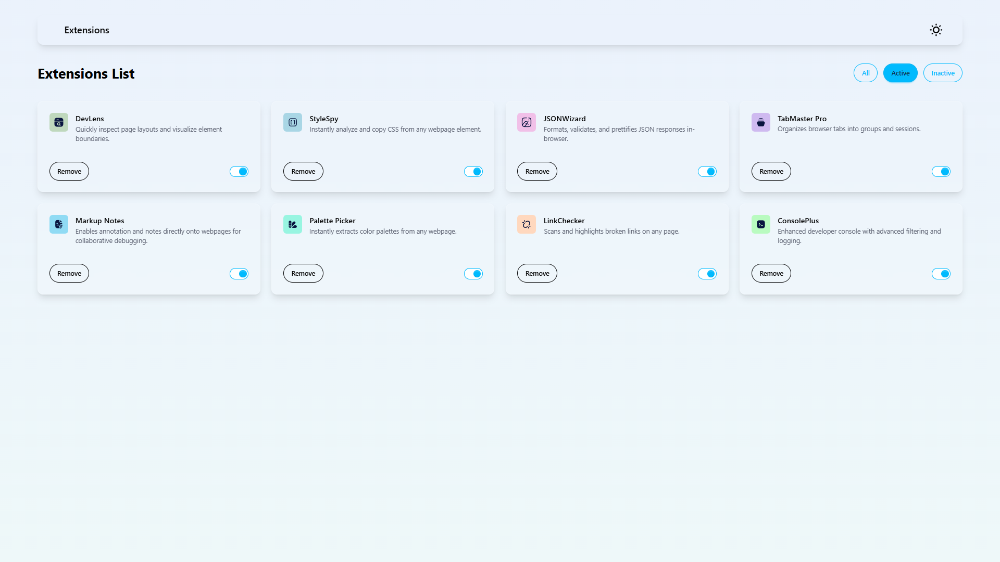
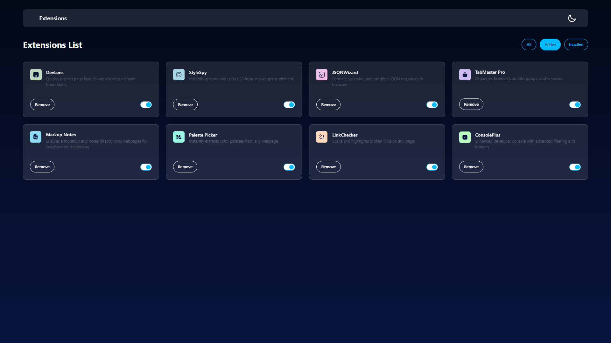
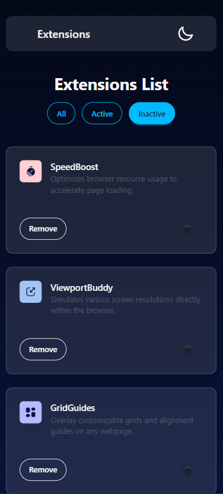

# Browser Extension Manager UI

A sleek and responsive user interface for managing browser extensions, built as part of a [Frontend Mentor](https://www.frontendmentor.io/) challenge.

## Features

- Toggle between **Dark** and **Light** modes  
- Fully **responsive** design for all screen sizes, including mobile devices  
- Filter extensions by **Active**, **All**, or **Inactive**  
- Ability to **remove** extensions from the list  
- Built with **React (TypeScript/TSX)**, **Tailwind CSS**, and **DaisyUI**

## Technologies Used

- [React](https://reactjs.org/) with **TypeScript (TSX)**  
- [Tailwind CSS](https://tailwindcss.com/)  
- [DaisyUI](https://daisyui.com/)

## Screenshots

### Light Mode  

### Dark Mode  

### Mobile View  

